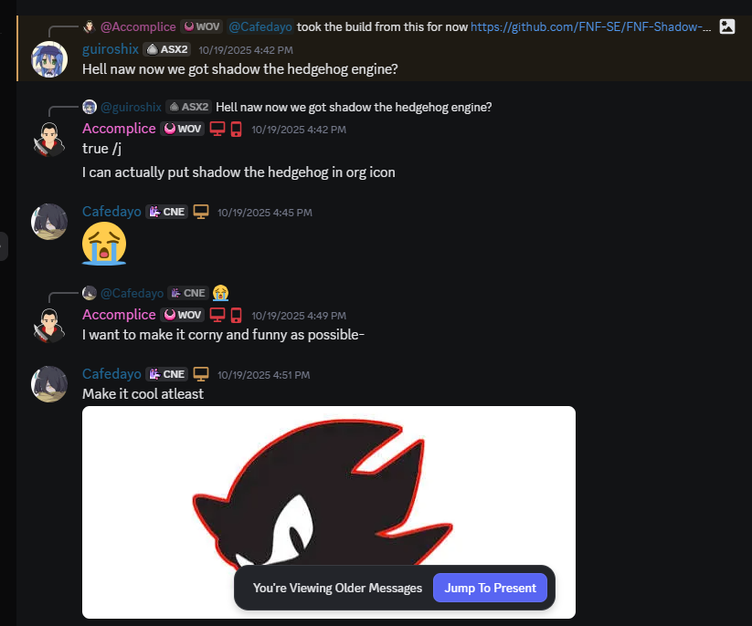

The origin of **Shadow Engine (SE)** began during the development of **[Gacha Horror Recreation (GHR)](https://github.com/FNF-SE/Gacha-Horror-2.5-Recreation)**, a source recreation of **[Gacha Horror V2.5](https://gamebanana.com/mods/442970)**. I wanted to recode it because I didn’t like the original HUD, Freeplay, and a few other features. The project initially used **Psych Engine (PE)** 0.6.3, but I upgraded it to 0.7.3-dev (which already had some 1.0 changes) because it performed better and 0.6.3’s optimization was pretty bad.  

For a while, it was just a modified PE build, until I started shadowing OpenFL and Flixel classes to add GPU texture support (way before V-Slice officially released it. I borrowed those features from someone else) because RAM usage was brutal, especially on low-end mobile devices (R.I.P. MobilePorting). After a while, I jokingly renamed the engine to **Shadow Engine**, since I’d ended up shadowing so many classes anyway. That's where the engine's name was born. 

Time passed, and I eventually decided to make the engine public. I thought the name was kind of lame or cringy at first, but it stuck and people in my Discord server actually liked it, which motivated me to keep fixing bugs and improving it.  

After two or three days of development, a couple of people came up with an idea for the icon (accidentally), and it was hilarious but it just fit.  

I couldn’t believe how well the name and icon matched in the end.
Huge thanks to;
- [@KarimAkra](https://github.com/KarimAkra)
- [@SantiYea](https://github.com/SantiYea)
- [@mrchaoss1](https://github.com/mrchaoss1)
- guiroshix (Discord)

for helping make this engine possible, even if it’s gonna get no longer active. I’m honestly glad and grateful that it ever existed.

and very lastly uhh here's a funny bug in SE before

