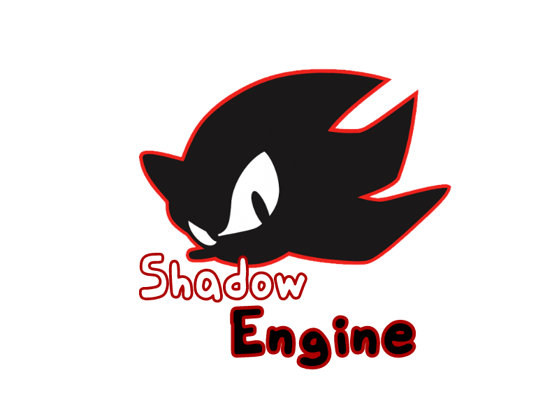

  

# Friday Night Funkin' - Shadow Engine

A highly modified Psych Engine 0.7.3.

Ready to be source-modded.

For the lore of this engine see [ORIGIN.md](./ORIGIN.md).

## Differences Between The Original
- Uses our haxelib forks for backporting and fixing stuff
- Uses latest Haxe
- Uses some code from [P-Slice](https://github.com/Psych-Slice/P-Slice), [Leather Engine (R.I.P.)](https://github.com/Vortex2Oblivion/LeatherEngine), [Codename Engine](https://github.com/CodenameCrew/CodenameEngine) and [REDACTED]
- Mobile Support (duh)
- Applies OpenAL Soft Config For better audio
- Slightly more accurate FPS and less RAM Usage
- Some 0.6.3 and 1.0 compability
- Linux ARM support (FNF on Raspberry Pi baby)
- Kade Engine Results Screen
- PlayState has `changeNoteSkin` for easy in-game note skin changing
- Play as Opponent
- Stripped to only have Test song and some characters
- Kade Engine Note Timing (man I feel old), VSync and Pop Up Score Option
- Includes all classes as possible into source
- Scriptable Classes Support!! (ig idk honestly if I did good job)

Discord server: https://discord.gg/krFK9WWYHg
